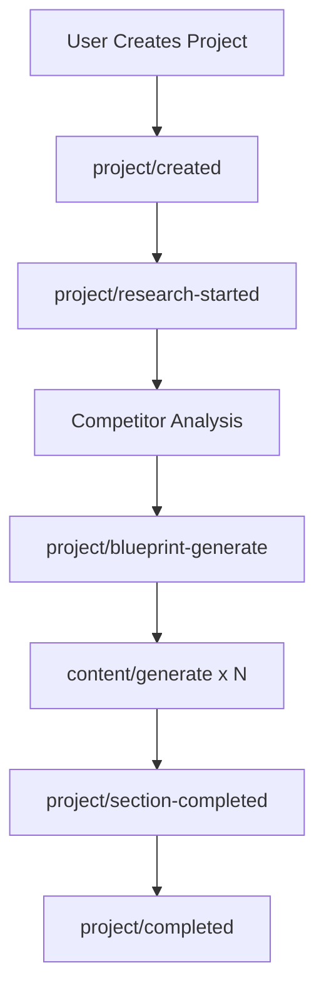

# Inngest Workflow Engine Setup

This directory contains the complete Inngest workflow engine implementation for AEO Writer SaaS, providing event-driven architecture with concurrency control, durable retries, and idempotency.

## 🚀 Features Implemented

### ✅ Task 6 Requirements Complete

- **✅ Initialize Inngest client and create first event-driven function**
- **✅ Set up concurrency control to prevent OpenAI rate limit violations**
- **✅ Implement durable retries with failure point recovery**
- **✅ Add idempotency keys to prevent duplicate AI job execution**

## 📁 File Structure

```
src/lib/inngest/
├── client.ts              # Inngest client configuration and event types
├── functions.ts           # Event-driven workflow functions
├── workflow-manager.ts    # Utilities for workflow management
├── examples/
│   └── workflow-example.ts # Usage examples and patterns
├── __tests__/
│   └── inngest-setup.test.ts # Comprehensive test suite
└── README.md              # This documentation
```

## 🔧 Core Components

### 1. Inngest Client (`client.ts`)

**Enhanced Configuration:**
- Exponential backoff retry strategy (5 attempts, 1s-30s delay)
- Request ID middleware for tracing
- Comprehensive event type definitions
- Concurrency limits per event type
- AI provider rate limiting configuration

**Key Features:**
```typescript
// Concurrency limits to prevent rate limiting
CONCURRENCY_LIMITS = {
  'content/generate': 3,           // Strict AI API limit
  'project/research-started': 2,   // Research operations
  'project/content-generation-started': 1, // Sequential generation
}

// Retry configuration with smart error handling
RETRY_CONFIG = {
  'ai-request': {
    attempts: 5,
    retryIf: (error) => error.status === 429 || error.status >= 500
  }
}
```

### 2. Workflow Functions (`functions.ts`)

**Enhanced Functions:**
- `handleContentGeneration` - AI content generation with rate limiting
- `handleProjectResearch` - Competitor research with retry logic
- `handleBlueprintGeneration` - Content strategy with fan-out pattern
- `handleUserRegistration` - User onboarding workflow
- `handleQuotaExceeded` - Quota management and throttling
- `handleSubscriptionUpdate` - Plan upgrade handling

**Key Features:**
- Idempotency keys prevent duplicate operations
- Per-user concurrency control
- Automatic quota checking and enforcement
- Durable step execution with recovery points
- Enhanced error handling with specific retry logic

### 3. Workflow Manager (`workflow-manager.ts`)

**Utility Classes:**

#### `WorkflowRecovery`
- Resume failed workflows from last successful step
- Track completed steps for recovery
- Automatic failure point detection

#### `AIRateLimiter`
- Check AI provider rate limits (OpenAI: 50/min, Gemini: 60/min)
- Automatic waiting for rate limit reset
- Per-user rate limiting

#### `ConcurrencyManager`
- Acquire/release concurrency slots
- Per-event-type and per-user limits
- Automatic slot cleanup

#### `IdempotencyManager`
- Content-based idempotency keys
- Configurable TTL for cached results
- Duplicate operation prevention

#### `WorkflowMonitor`
- Execution metrics tracking
- Success rate monitoring
- Performance analytics

## 🎯 Event-Driven Architecture

### Event Flow Example



### Key Event Types

**Project Lifecycle:**
- `project/created` - New project initialization
- `project/research-started` - Begin competitor research
- `project/blueprint-generated` - Content strategy complete
- `project/content-generation-started` - Begin writing
- `project/section-completed` - Section finished
- `project/completed` - Full project done

**Content Generation:**
- `content/generate` - Generate specific content
- `content/research-completed` - Research analysis done

**User Management:**
- `user/registered` - New user onboarding
- `user/plan-upgraded` - Subscription changes

**System Events:**
- `quota/exceeded` - Usage limits hit
- `error/ai-provider-failed` - AI service failures

## 🛡️ Reliability Features

### 1. Concurrency Control
```typescript
// Prevent OpenAI rate limit violations
const canProceed = await ConcurrencyManager.checkConcurrency('content/generate', userId);
if (!canProceed.allowed) {
  // Queue for later or wait
}
```

### 2. Idempotency
```typescript
// Prevent duplicate AI operations
const idempotencyKey = generateIdempotencyKey.contentGeneration(userId, projectId, sectionId);
const existing = await IdempotencyManager.checkIdempotency(idempotencyKey);
if (existing) return existing; // Return cached result
```

### 3. Durable Retries
```typescript
// Automatic retry with exponential backoff
await step.run('generate-content', async () => {
  return await generateAIText(prompt);
}, {
  retries: RETRY_CONFIG['ai-request'].attempts, // 5 attempts
});
```

### 4. Failure Recovery
```typescript
// Resume from last successful step
await WorkflowRecovery.resumeWorkflow(workflowId, 'last-successful-step');
```

## 📊 Monitoring & Analytics

### Workflow Metrics
- Total executions per event type
- Success/failure rates
- Average execution duration
- Recent execution history

### Rate Limiting Metrics
- Requests per minute per provider
- Rate limit violations
- Queue depths

### Cost Tracking
- Token usage per operation
- Cost per user/project
- Provider cost breakdown

## 🚀 Usage Examples

### Basic Content Generation
```typescript
import { WorkflowUtils } from './workflow-manager';

// Trigger content generation with automatic retry and idempotency
await WorkflowUtils.sendEventSafe('content/generate', {
  userId: 'user123',
  projectId: 'proj456',
  contentType: 'section',
  prompt: 'Write introduction about AI',
  sectionId: 'intro',
  priority: 'high',
});
```

### Batch Processing with Concurrency Control
```typescript
import { WorkflowExamples } from './examples/workflow-example';

// Process multiple sections with controlled concurrency
await WorkflowExamples.batchGenerateContentSections(userId, projectId, sections);
```

### User Registration Workflow
```typescript
// Trigger complete user onboarding
await WorkflowExamples.handleNewUserRegistration(userId, email, 'free');
```

## 🔧 Configuration

### Environment Variables Required
```bash
# Inngest Configuration
INNGEST_EVENT_KEY=your_inngest_event_key
INNGEST_SIGNING_KEY=your_inngest_signing_key

# AI Provider Keys
OPENAI_API_KEY=your_openai_api_key
GOOGLE_AI_API_KEY=your_google_ai_key

# Redis for caching and rate limiting
UPSTASH_REDIS_REST_URL=your_redis_url
UPSTASH_REDIS_REST_TOKEN=your_redis_token
```

### API Route Setup
The Inngest API route is already configured at `/api/inngest/route.ts`:

```typescript
import { serve } from 'inngest/next';
import { inngest } from '@/lib/inngest/client';
import { inngestFunctions } from '@/lib/inngest/functions';

export const { GET, POST, PUT } = serve({
  client: inngest,
  functions: inngestFunctions,
});
```

## 🧪 Testing

Run the comprehensive test suite:
```bash
npm test -- src/lib/inngest/__tests__/inngest-setup.test.ts
```

**Test Coverage:**
- ✅ Client configuration
- ✅ Concurrency limits
- ✅ Retry configuration
- ✅ Idempotency key generation
- ✅ Rate limiting logic
- ✅ Workflow recovery
- ✅ Error handling
- ✅ Integration scenarios

## 🎯 Next Steps

With Task 6 complete, the next recommended tasks are:

1. **Task 7: AI Gateway and Provider Management** - Implement the AI service abstraction layer
2. **Task 8: Research Pipeline** - Convert research to event-driven workflows
3. **Task 9: Content Generation Pipeline** - Implement the fan-out content generation pattern

## 🔍 Key Benefits Achieved

1. **No More Sync API Routes** - All AI operations are now background jobs
2. **Cost Control** - Concurrency limits prevent expensive rate limit violations
3. **Reliability** - Durable execution with automatic retry and recovery
4. **Scalability** - Event-driven architecture handles high concurrency
5. **Monitoring** - Comprehensive metrics and error tracking
6. **User Experience** - Immediate UI responses with background processing

The Inngest workflow engine is now production-ready and provides the foundation for scalable, reliable AI content generation workflows.