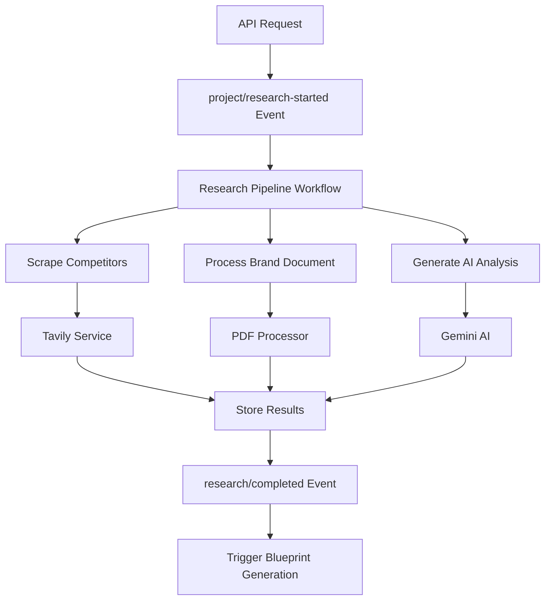

# Research Pipeline Implementation

This document describes the event-driven research pipeline implementation for the AEO Writer SaaS application.

## Overview

The research pipeline is an event-driven workflow built with Inngest that handles:
- Competitor URL scraping using Tavily API
- PDF processing and brand document analysis
- AI-powered research analysis using Gemini
- Progress tracking and error handling
- Retry logic and idempotency

## Architecture



## Components

### 1. Tavily Service (`src/lib/services/tavily.ts`)

Handles web scraping and competitor analysis:

```typescript
// Scrape competitor URLs
const competitorData = await tavilyService.scrapeCompetitors([
  'https://competitor1.com',
  'https://competitor2.com'
]);

// Analyze content for insights
const analysis = await tavilyService.analyzeContent(content);
```

**Features:**
- Retry logic with exponential backoff
- Caching for duplicate requests
- Concurrent processing with rate limiting
- Content analysis and keyword extraction

### 2. PDF Processor (`src/lib/services/pdf-processor.ts`)

Processes brand documents and extracts insights:

```typescript
// Process PDF file
const result = await pdfProcessor.processPDF(file, userId, projectId);

// Extract brand analysis
const brandAnalysis = result.brandAnalysis;
```

**Features:**
- PDF text extraction
- Vector embeddings generation
- Brand analysis using AI
- Chunk-based processing for large documents

### 3. Research Pipeline Workflow (`src/lib/inngest/research-pipeline.ts`)

Main orchestration workflow:

```typescript
// Trigger research pipeline
await inngest.send({
  name: 'project/research-started',
  data: {
    userId,
    projectId,
    competitorUrls,
    brandDocumentPath,
    topic,
    tone,
    format
  }
});
```

**Features:**
- Event-driven architecture
- Idempotency protection
- Progress tracking
- Error handling and retries
- Database integration

## API Endpoints

### Start Research Pipeline

```http
POST /api/projects/{id}/research
Content-Type: application/json

{
  "competitorUrls": [
    "https://competitor1.com",
    "https://competitor2.com"
  ],
  "brandDocument": "path/to/brand-document.pdf"
}
```

### Get Research Status

```http
GET /api/projects/{id}/research
```

### Cancel Research

```http
DELETE /api/projects/{id}/research
```

## Event Flow

1. **project/research-started** - Triggers the main research workflow
2. **project/status-updated** - Real-time progress updates
3. **research/completed** - Research phase completed
4. **research/retry** - Retry failed operations
5. **project/blueprint-generate** - Triggers next phase

## Configuration

### Environment Variables

```bash
# Tavily API Configuration
TAVILY_API_KEY=your_tavily_api_key

# AI Provider Configuration
GOOGLE_AI_API_KEY=your_google_ai_key

# Supabase Configuration
NEXT_PUBLIC_SUPABASE_URL=your_supabase_url
SUPABASE_SERVICE_ROLE_KEY=your_service_role_key

# Inngest Configuration
INNGEST_EVENT_KEY=your_inngest_event_key
INNGEST_SIGNING_KEY=your_inngest_signing_key

# Redis Configuration
UPSTASH_REDIS_REST_URL=your_redis_url
UPSTASH_REDIS_REST_TOKEN=your_redis_token
```

### Concurrency Limits

```typescript
export const CONCURRENCY_LIMITS = {
  'project/research-started': 2, // Limit research operations
  'content/generate': 3, // Limit AI API calls
  default: 10,
} as const;
```

### Retry Configuration

```typescript
export const RETRY_CONFIG = {
  'ai-request': {
    attempts: 5,
    delay: '2s',
    maxDelay: '60s',
    backoff: 'exponential',
  },
  'external-api': {
    attempts: 4,
    delay: '1s',
    maxDelay: '30s',
    backoff: 'exponential',
  },
} as const;
```

## Usage Examples

### Basic Research Pipeline

```typescript
import { inngest } from '@/lib/inngest/client';

// Trigger research for a project
const result = await inngest.send({
  name: 'project/research-started',
  data: {
    userId: 'user_123',
    projectId: 'project_456',
    competitorUrls: [
      'https://competitor1.com',
      'https://competitor2.com'
    ],
    topic: 'SEO Best Practices',
    tone: 'professional',
    format: 'how-to'
  }
});
```

### Monitor Progress

```typescript
// Listen for progress updates
const handleProgress = (event) => {
  if (event.name === 'project/status-updated') {
    console.log(`Progress: ${event.data.progress}%`);
    console.log(`Status: ${event.data.status}`);
    console.log(`Message: ${event.data.message}`);
  }
};
```

### Handle Completion

```typescript
// Process research results
const handleCompletion = (event) => {
  if (event.name === 'research/completed') {
    const { researchData, tokensUsed, cost } = event.data;
    
    console.log('Research completed!');
    console.log('Competitors analyzed:', researchData.competitorData.length);
    console.log('Tokens used:', tokensUsed);
    console.log('Cost:', cost);
  }
};
```

## Error Handling

### Retry Logic

The pipeline includes comprehensive retry logic:

- **Network errors**: Exponential backoff with jitter
- **Rate limits**: Automatic retry after cooldown
- **Temporary failures**: Configurable retry attempts
- **Permanent failures**: No retry, error logging

### Fallback Strategies

- **Tavily API failure**: Continue with available data
- **PDF processing failure**: Skip brand analysis
- **AI analysis failure**: Generate basic fallback analysis

### Error Events

```typescript
// Handle research errors
const handleError = (event) => {
  if (event.name === 'research/error') {
    const { projectId, error, retryable } = event.data;
    
    if (retryable) {
      // Schedule retry
      await inngest.send({
        name: 'research/retry',
        data: { projectId, retryReason: error }
      });
    } else {
      // Mark project as failed
      await updateProjectStatus(projectId, 'error');
    }
  }
};
```

## Performance Optimization

### Caching Strategy

- **Competitor data**: 1 hour cache
- **Brand analysis**: 2 hours cache
- **AI responses**: 1 hour cache for expensive operations

### Concurrency Control

- **Tavily API**: 3 concurrent requests max
- **AI requests**: 5 concurrent requests max
- **Per-user limits**: Prevent resource abuse

### Cost Optimization

- **Model selection**: Use Gemini for cost-effective analysis
- **Token tracking**: Monitor and optimize usage
- **Batch processing**: Group similar operations

## Testing

### Unit Tests

```bash
npm test -- --testPathPatterns="research-pipeline"
```

### Integration Tests

```bash
npm test -- --testPathPatterns="research.*route"
```

### Manual Testing

```typescript
// Test Tavily service
const result = await tavilyService.healthCheck();
console.log('Tavily health:', result);

// Test PDF processor
const health = await pdfProcessor.healthCheck();
console.log('PDF processor health:', health);
```

## Monitoring

### Metrics to Track

- **Processing time**: Average research completion time
- **Success rate**: Percentage of successful research operations
- **Cost per research**: Token usage and API costs
- **Error rates**: Failed operations by type

### Alerts

- **High error rate**: > 10% failures in 5 minutes
- **Long processing time**: > 5 minutes average
- **Cost threshold**: > $1 per research operation
- **API rate limits**: Approaching provider limits

## Deployment

### Production Checklist

- [ ] Environment variables configured
- [ ] Database migrations applied
- [ ] Inngest functions deployed
- [ ] Redis cache configured
- [ ] Monitoring alerts set up
- [ ] Rate limits configured
- [ ] Error handling tested

### Scaling Considerations

- **Horizontal scaling**: Multiple Inngest workers
- **Database optimization**: Proper indexing
- **Cache warming**: Pre-populate common queries
- **Load balancing**: Distribute API requests

## Troubleshooting

### Common Issues

1. **Tavily API errors**
   - Check API key configuration
   - Verify rate limits
   - Test with simple queries

2. **PDF processing failures**
   - Validate file format and size
   - Check Supabase storage permissions
   - Test with sample files

3. **AI analysis timeouts**
   - Reduce prompt complexity
   - Check model availability
   - Implement fallback responses

4. **Database connection issues**
   - Verify connection pooling
   - Check RLS policies
   - Monitor connection limits

### Debug Mode

Enable debug logging:

```bash
LOG_LEVEL=debug npm run dev
```

### Health Checks

```typescript
// Check all services
const health = await Promise.all([
  tavilyService.healthCheck(),
  pdfProcessor.healthCheck(),
  // Add other service checks
]);

console.log('Service health:', health);
```

## Future Enhancements

### Planned Features

- [ ] Real-time competitor monitoring
- [ ] Advanced content gap analysis
- [ ] Multi-language support
- [ ] Custom research templates
- [ ] Automated research scheduling

### Performance Improvements

- [ ] Streaming responses for large datasets
- [ ] Parallel processing optimization
- [ ] Advanced caching strategies
- [ ] Cost optimization algorithms

### Integration Opportunities

- [ ] Additional web scraping services
- [ ] More AI providers for redundancy
- [ ] Advanced analytics platforms
- [ ] Custom embedding models